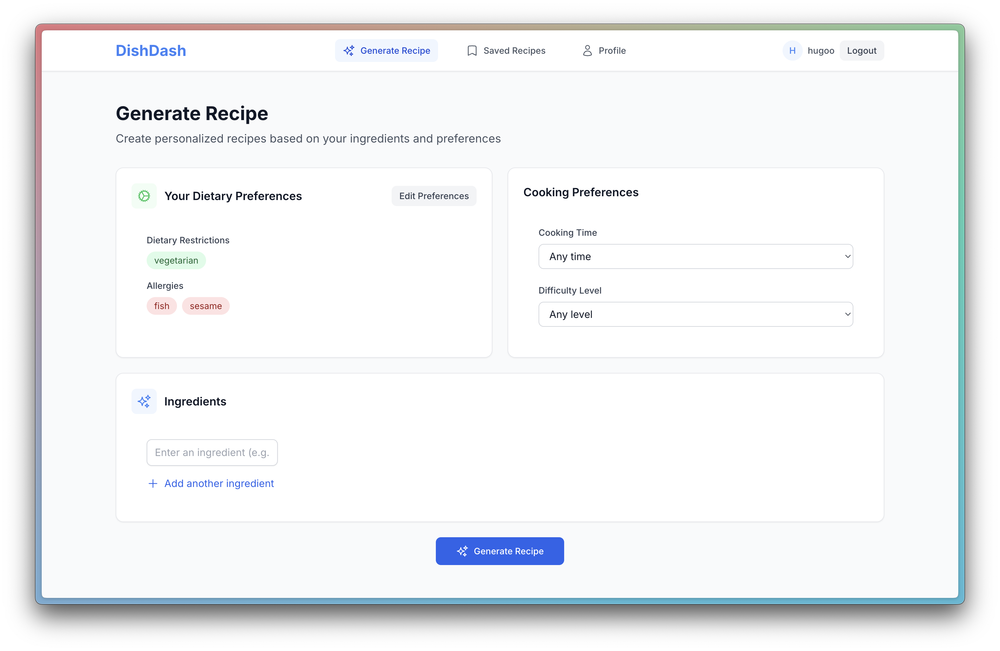
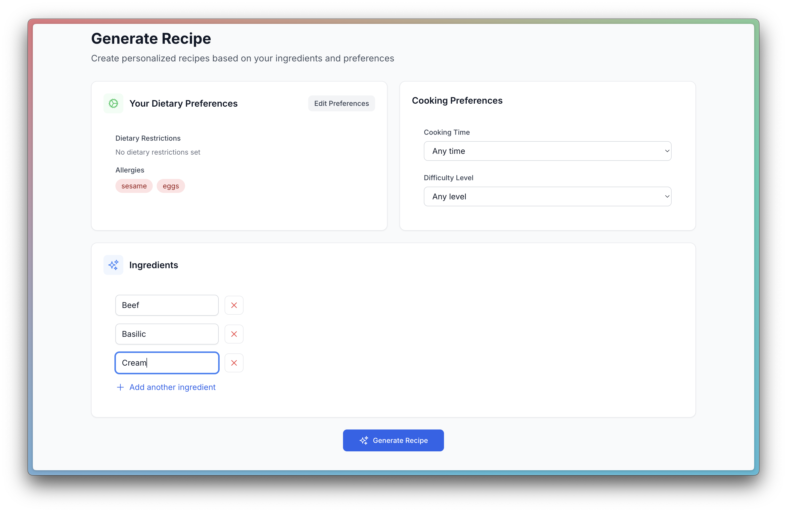
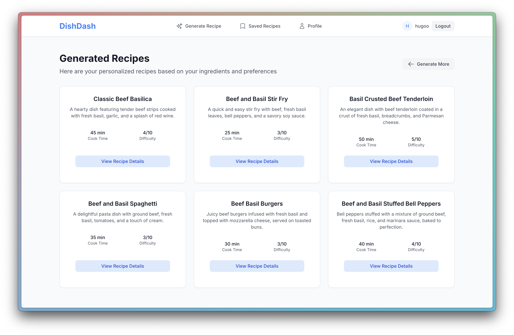
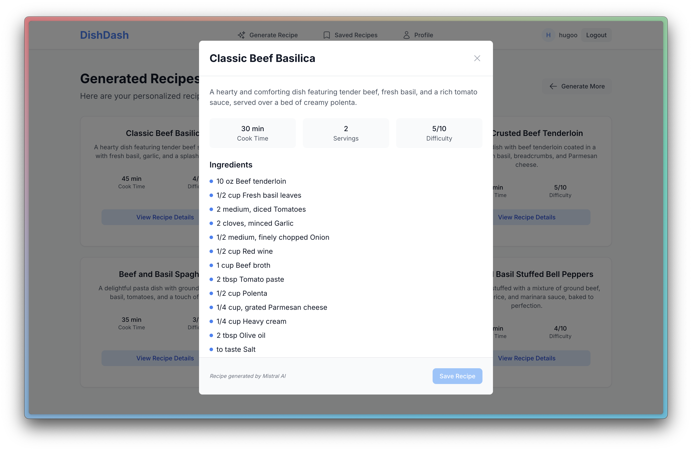

# 🍳 DishDash

**Transform your fridge into a creative kitchen!** Enter your ingredients, set your constraints (time, preferences), and receive personalized recipes generated by Mistral AI. Save your recipes and cook without stress!

## 🖼️ Screenshots

<div align="center">

### Recipe Generation Form

*Clean form interface for dietary preferences and cooking time*


*Dynamic ingredient input with real-time validation*

### AI Recipe Generation

*Mistral AI generating 6 personalized recipes*


*Mistral AI detailed recipe view with ingredients and instructions*

### Saved Recipes

*Personal recipe collection with search functionality*

</div>

## ✨ Features

- **🎨 Blue & White Design** : Clean pastel color scheme
- **🔐 Simple Auth** : Username-only login
- **🤖 AI Recipes** : Generate 6 recipes with Mistral AI
- **💾 Save System** : Save/unsave recipes with real-time updates
- **🔍 Search** : Filter saved recipes
- **📱 Mobile** : Responsive design with hamburger menu

## 🚀 Tech Stack

- **Frontend**: Next.js 14 + TypeScript + Tailwind CSS
- **Backend**: Python + FastAPI + SQLAlchemy
- **AI**: Mistral API integration
- **Database**: PostgreSQL

## 📦 Quick Start

```bash
# Clone the repository
git clone git@github.com:hugobrun343/DishDash.git
cd DishDash

# Start development environment
docker-compose up
```

## 🏗️ Project Structure

```
DishDash/
├── frontend/            # Next.js frontend
│   ├── src/            # Source code
│   └── screenshots/    # App screenshots
├── backend/            # Python FastAPI
│   ├── app/            # Application code
│   ├── tests/          # Test files
│   └── database/       # DB initialization scripts
├── .github/workflows/  # CI/CD pipelines
├── docker-compose.yml  # Development environment
└── README.md
```

## 🛠️ Development

See individual README files in `backend/` and `frontend/` directories for detailed setup instructions.
